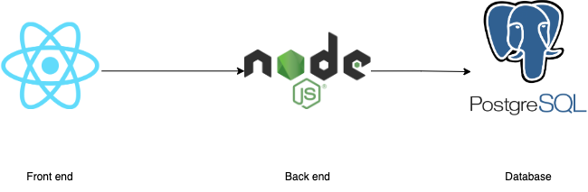

# Pre-Requisites

- Git
- GitHub Account
- Docker 
- Local Kubernetes Cluster (Kind, Minikube)
- kubectl
- DockerHub Account (https://hub.docker.com/)
- AWS CLI (https://docs.aws.amazon.com/cli/latest/userguide/getting-started-install.html)


## Running with Kind

If you use kind for this workshop create it with Ingress support.

[Kind config with ingress support](https://dustinspecker.com/posts/test-ingress-in-kind/)

```
kind: Cluster
apiVersion: kind.x-k8s.io/v1alpha4
nodes:
  - role: control-plane
    kubeadmConfigPatches:
      - |
        kind: InitConfiguration
        nodeRegistration:
          kubeletExtraArgs:
            node-labels: "ingress-ready=true"        
    extraPortMappings:
      - containerPort: 80
        hostPort: 80
        protocol: TCP
      - containerPort: 443
        hostPort: 443
        protocol: TCP
```


## Optional

- kubectx and kubens (https://github.com/ahmetb/kubectx)

# The App!



[Front end](https://github.com/r-magalhaes/ws-frontend)

[Back end](https://github.com/r-magalhaes/ws-backend)

[Database](https://github.com/r-magalhaes/ws-database)

# The Problem...

We've been managing the deployment of this application in an on-premise. So far this app is been used inside of your organisation which made it pretty simples to manage all around. You've dockarized the Front-end, Back-end and even the Database. Now your organisation decided to launch the app online for other people to use it.

Some things to take into consideration:
- You're aware you'll need to have control over increasing/decreasing load when the App goes live
- The App is still somewhat raw which means new updates will arrive and you want to have a system in place to have automated deployments
- You also want to take advantage of the dockerized images you already have

You've chosen to use Kubernetes as the container orchestration tool!


# The Challenge...

## To the clouds!!!

- Take the application (frontend, backend and database) and deploy it in a Kubernetes cluster.
- Create the necessary resources for all parts to communicate with each other.
- Make sure that all configuration and secrets are managed via Kubernetes resources and not injected on the images via docker build arguments.